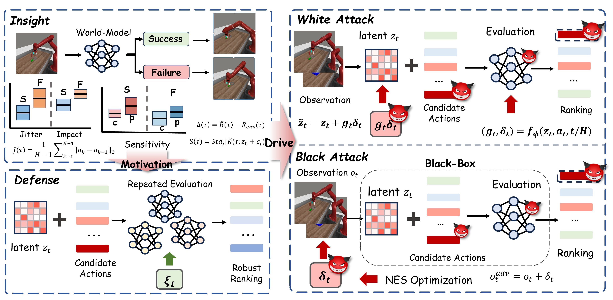

# [VSAD: Valuation-Sensitivity Attacks and Robust Defense for Latent World-Model Planning]
<br/>


# Eval
```
sh ./VSAD/run/eval.sh
```

# White-box Attack
```
./VSAD/run/eval_WA.sh
```

# White-box Defense
```
./VSAD/run/eval_WD.sh
```


# Black-box Attack
```
./VSAD/run/eval_BA.sh
```

# Black-box Defense
```
./VSAD/run/eval_BD.sh
```

